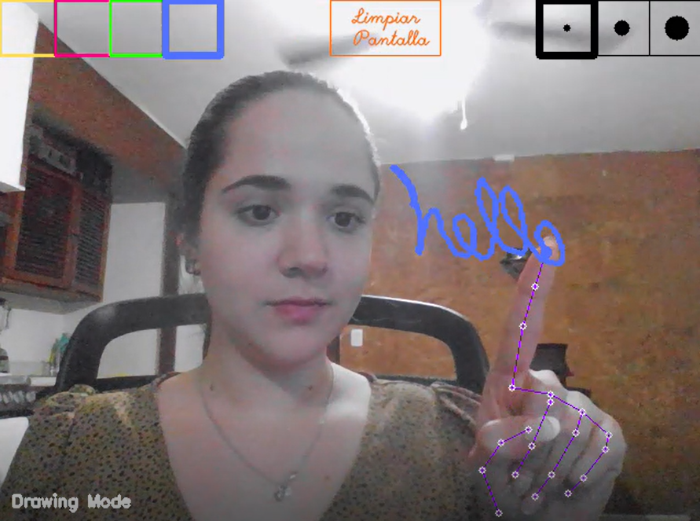

## Reto-4-CV-Challenges

# Magic board.
Create your own magic board to draw in the air with your finger by using hand tracking detection.

The steps of the project are the following:
  - Create your color, thickness and clear screen boxes.
  - Use MediaPipe Hands to detect and track your fingers to draw.
  - Give your fingers the functionality to draw or select a color/thickness.
  - Display the final result.

## Create your magic board display.
Use an array of zeros that will work as a board.
Create your color, thickness and clear screen boxes. Feel free to change the colors and thickness of the markers.

## Hand detection by using the MediaPipe Hands Solution.
MediaPipe is a Framework for building machine learning pipelines for processing time-series data. In this case we will be using MediaPipe Hands which allows us to track hands and fingers by employing ML to interfet 21 3D landmarks of a hand.
Refer to https://github.com/pattycanales/Reto-3-CV-Challenges

## Drawing.
Use your index finger to draw. If you want to change color or thickness of your drawing, use your index and middle fingers to select the desired color/thickness and start to draw.
If you want to stop drawing, I recommend you to close your hand in a fist so the hand detector doesn't detect your fingers.

## Results.
Enjoy!

## References.
  - https://www.youtube.com/watch?v=KlVSqdF0EWs&t=746s
  - https://google.github.io/mediapipe/solutions/hands.html
  - https://www.youtube.com/watch?v=ipHKQVtwRas&t=1108s
  - https://www.youtube.com/watch?v=_zjKszdAVG8&t=652s

Thanks for reading!

_Patty Canales_
